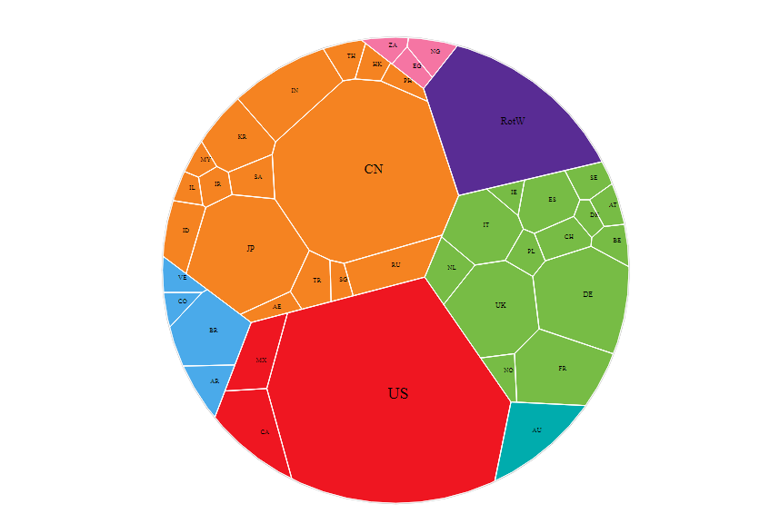
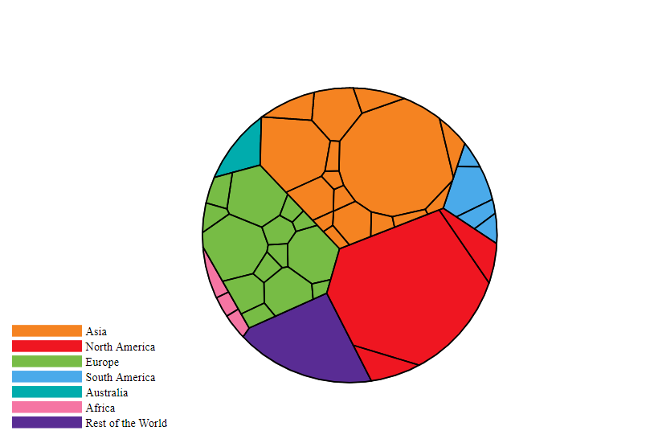
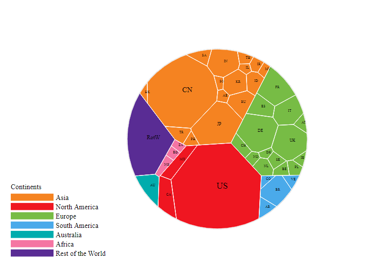
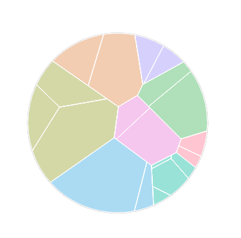
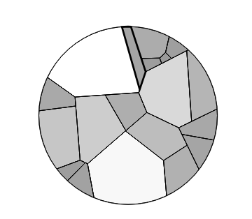

<!-- README.md is generated from README.Rmd. Please edit that file -->
 [](https://coveralls.io/github/uRosConf/voronoiTreemap?branch=master) [](https://CRAN.R-project.org/package=voronoiTreemap) [](https://CRAN.R-project.org/package=voronoiTreemap) <!--[](http://www.awesomeofficialstatistics.org)-->

voronoiTreemap
==============

This is the development place for R-package voronoiTreemap

Created at unconfUROS2018
-------------------------

-   A side event to the annual conference [The Use of R in Official Statistics](http://r-project.ro/conference2019.html)
-   <https://github.com/uRosConf/unconfUROS2018>

Idea
----

-   Make it easy to create a plot like this:

``` r
knitr::include_graphics("documentation/preisKalei.jpg")
```


R package
---------

-   [https://github.com/uRosConf/voronoiTreemap](https://github.com/uros2018/voronoiTreemap)
-   important functions:
    -   *vt\_input\_from\_df* ... easy data input as a data frame
    -   *vt\_export\_json* ... export to json
    -   *vt\_d3* ... create an htmlwidget
    -   *vt\_app* ... start a shiny to create a Voronoi treemap

``` r
library(voronoiTreemap)
data(ExampleGDP)
knitr::kable(head(ExampleGDP,3))
```

| h1    | h2   | h3    | color    |  weight| codes |
|:------|:-----|:------|:---------|-------:|:------|
| Total | Asia | China | \#f58321 |   14.84| CN    |
| Total | Asia | Japan | \#f58321 |    5.91| JP    |
| Total | Asia | India | \#f58321 |    2.83| IN    |

Create a first graph
--------------------

``` r
gdp_json <- vt_export_json(vt_input_from_df(ExampleGDP))
vt_d3(gdp_json)
```



There a couple of settings you can change I
-------------------------------------------

``` r
vt_d3(gdp_json,label = FALSE, color_border = "#000000", size_border = "2px", legend = TRUE)
```



There a couple of settings you can change II
--------------------------------------------

-   You can set a seed (in Javascript)!

``` r
vt_d3(gdp_json, legend = TRUE, legend_title = "Continents", seed = 1)
```



A 2nd Example (Canadian Consumer Price Index) I
-----------------------------------------------

-   Colors can be provided for each cell independently.

``` r
data(canada)
canada <- canada[canada$h1=="Canada",]
canada$codes <- canada$h3
canadaH <- vt_export_json(vt_input_from_df(canada,scaleToPerc = FALSE))
vt_d3(canadaH, label=FALSE,width = 400,height = 400)
```



A 2nd Example (Canadian Consumer Price Index) II
------------------------------------------------

-   Colors could be computed according to a numeric variable, e.g. with the *scales* package.

``` r
canada$color <- scales::seq_gradient_pal(low = "#999999",high = "#ffffff")(canada$weight/max(canada$weight))
canadaH <- vt_export_json(vt_input_from_df(canada,scaleToPerc = FALSE))
vt_d3(canadaH, label=FALSE,width = 400,height = 400, color_border = "#000000")
```



Shiny App I
-----------

``` r
knitr::include_graphics("documentation/shiny1.jpg")
```


Shiny App II
------------

``` r
knitr::include_graphics("documentation/shiny2.jpg")
```


