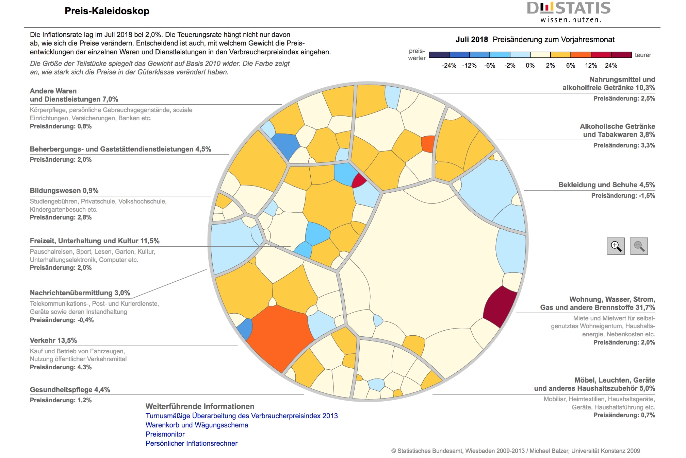
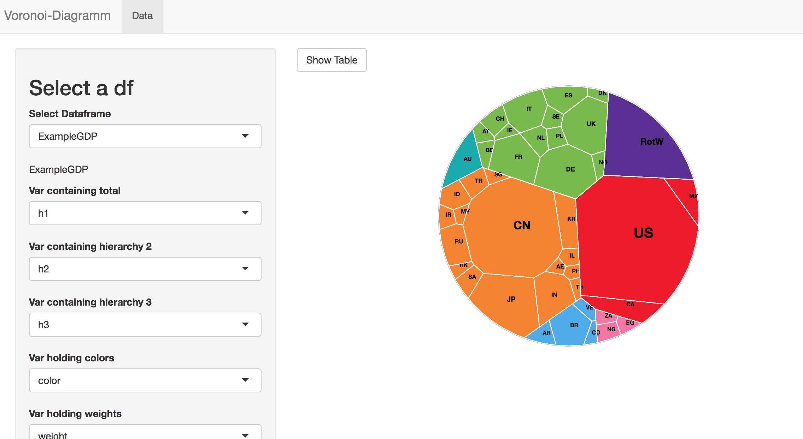

```{r setup, include=FALSE}
knitr::opts_chunk$set(echo = FALSE)
```

## Idea
 - Make it easy to create a plot like this:
 
```{r, out.width = "800px"}

```

## R package

- [https://github.com/uros2018/voronoiTreemap](https://github.com/uros2018/voronoiTreemap)
- important functions:
   - *vt_input_from_df*  ... easy data input as a data frame
   - *vt_export_json*    ... export to json
   - *vt_d3*             ... create an htmlwidget
   - *vt_app*            ... start a shiny to create a Voronoi treemap
```{r, echo = TRUE}
library(voronoiTreemap)
data(ExampleGDP)
knitr::kable(head(ExampleGDP,3))
```

## Create a first graph

```{r, echo = TRUE}
gdp_json <- vt_export_json(vt_input_from_df(ExampleGDP))
vt_d3(gdp_json)
```

## There a couple of settings you can change I

```{r, echo = TRUE}
vt_d3(gdp_json,label = FALSE, color_border = "#000000", size_border = "2px", legend = TRUE)
```

## There a couple of settings you can change II
 - You can set a seed (in Javascript)!
```{r, echo = TRUE}
vt_d3(gdp_json, legend = TRUE, legend_title = "Continents", seed = 1)
```


## A 2nd Example (Canadian Consumer Price Index) I
 - Colors can be provided for each cell independently.
```{r, echo = TRUE}
data(canada)
canada <- canada[canada$h1=="Canada",]
canada$codes <- canada$h3
canadaH <- vt_export_json(vt_input_from_df(canada,scaleToPerc = FALSE))
vt_d3(canadaH, label=FALSE,width = 400,height = 400)
```

## A 2nd Example (Canadian Consumer Price Index) II
 - Colors could be computed according to a numeric variable, e.g. with the *scales* package.
```{r, echo = TRUE}
canada$color <- scales::seq_gradient_pal(low = "#999999",high = "#ffffff")(canada$weight/max(canada$weight))
canadaH <- vt_export_json(vt_input_from_df(canada,scaleToPerc = FALSE))
vt_d3(canadaH, label=FALSE,width = 400,height = 400, color_border = "#000000")
```

## Shiny App I

```{r, out.width = "800px"}
knitr::include_graphics("shiny1.jpg")
```

## Shiny App II
```{r, out.width = "800px"}

```

## Conclusion
 - Package is 90% ready, hopefully available on CRAN soon.
 - Great event!! Thanks to the organizers and attendees.
 - [https://github.com/uros2018/voronoiTreemap](https://github.com/uros2018/voronoiTreemap)
